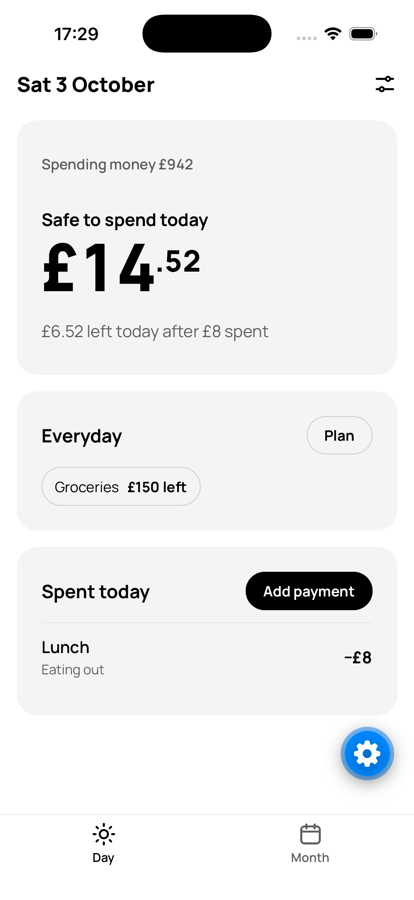
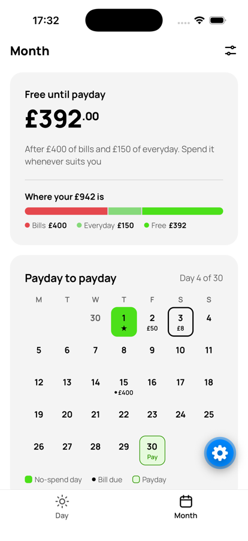
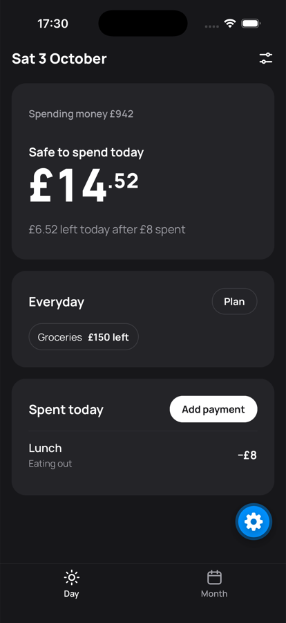

# Money tracker

A personal money app that answers one question first: **what can I spend today?**

It runs as a published Claude artifact. The live app is at
https://claude.ai/artifact/LxyJ6x8CNjaQXzw84mZfgk

## Files

| File | What it is |
|---|---|
| `src/index.html` | The page layout (markup only) |
| `src/styles.css` | All the styles |
| `src/app.js` | All the logic |
| `build.mjs` | Joins the three into one file for publishing |
| `CLAUDE.md` | Notes for Claude Code: how the app works and the rules it follows |

## Making a change

1. Edit the files in `src/`.
2. Run `npm run build`. This writes `dist/money-tracker.html`.
3. Publish: attach `dist/money-tracker.html` in the Claude chat and ask Claude to publish it to the live link.
   Publishing to the same link keeps your saved data and the Monzo connection.
4. Commit your change with git.

## Why it has to be one file

The live app is a Claude artifact. Those must be a single self-contained page, and they get
their storage (`window.claude` database), your sign-in, and the Monzo connection from Claude.
Opening `src/index.html` straight in a browser shows the layout, but saving and Monzo
won't work outside Claude.

## Mobile app

`mobile/` is a phone version of the core of the app, built with Expo, React Native and TypeScript.
It keeps everything on the phone (SQLite) and you type your balance in rather than connecting Monzo.

<p>
  
  
  
</p>

### How it works

The daily number is (spending money − bills due before payday − what's left of everyday amounts) ÷ days to payday.

1. **Engine** (`src/lib/`): pure TypeScript with no React or storage. It works out pay and bill dates (pay moves earlier off weekends and bank holidays, bills move later), pay check-ins, the daily number, the calendar and the split. Every function takes `{state, payments, today}`, so it's straightforward to unit test. It was checked against the original web app's engine on the same inputs.
2. **Storage** (`src/db/`): payments go in a SQLite table as whole pence, so totals never pick up floating-point errors. Schema changes are versioned migrations.
3. **State** (`src/store/`): a Zustand store holds settings (income, bills, categories) and saves them on the phone. A payment is written to the database before the screen shows it, and a failed write shows a message instead.
4. **Screens** (`src/app/`): Expo Router tabs (Day, Month) and modal forms. They read from the engine and contain no money logic.

Rules it follows: money only counts once it has arrived (payday asks "did it land?"), and it never scolds. A big day just lowers the days after.

### Roadmap

- **v1** (now): on-device app, manual balance.
- **v2**: Supabase sign-in and Postgres sync, with SQLite still the offline source.
- **v3**: server-side logic (Edge Functions).
- **v4**: Open Banking, so the balance and payments come in automatically.

```sh
cd mobile
npm install
npx expo start      # scan the QR code with Expo Go, or press i for the iOS simulator
npm test            # the money engine and screens
npm run typecheck
npm run lint
```

| Folder | What it is |
|---|---|
| `mobile/src/lib/` | The money engine: pay and bill dates, bank holidays, the daily number. Tested. |
| `mobile/src/db/` | Payments, stored in SQLite in whole pence |
| `mobile/src/store/` | App state (Zustand), saved on the phone |
| `mobile/src/app/` | The screens: Day, Month, and the forms |
| `mobile/src/components/` | Pieces the screens share |
